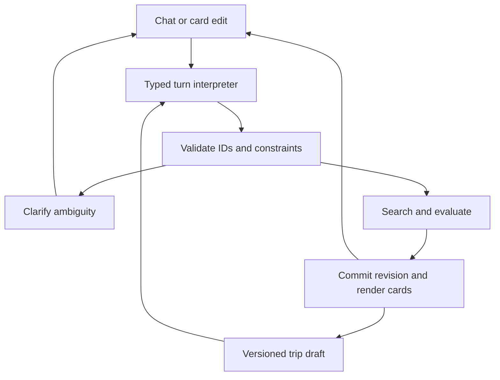

# Conversational trip workspace: product direction and implementation instructions

Updated 12 September 2026 following Venkat's clarification. Status: proposed implementation, not delivered application behavior. Reviewed application baseline: `0f02d7a0f146ea07fb3999fdf66e3a725ef50727`; main was fetched again and remained unchanged. This document supersedes the earlier cheapest-first product framing and implementation sequence. It preserves the flight, ground, pricing and recovery requirements in [CHEAPEST_MULTIMODAL_TRAVEL_PLAN.md](CHEAPEST_MULTIMODAL_TRAVEL_PLAN.md).

## 1. The main feature

**A traveler can plan, compare, customize and manage an entire bus, train or flight journey through a continuing conversation with Wayline.** The conversation presents usable travel options and editable itinerary cards. Cheapest, fastest, more reliable and recommended are views of those options. Monitoring, backup routes and ticket transactions are capabilities available within the same experience.

The traveler should be able to say “keep that flight, replace the bus with a train, and arrive before noon,” see the updated complete trip, understand the difference, and continue refining it without re-entering unchanged details. This must work for unsaved drafts as well as saved journeys. Existing purchased tickets need their own servicing workflow when affected.

Chat is the primary entry point and control surface. It is not limited to text bubbles: cards, comparisons, an editable timeline, maps, constraint chips and confirmations belong inside the conversation workspace. Direct controls and natural language must update the same server-owned draft. Preserve the normal Planner as another view over this state and as a usable fallback.

“All options” means access to the valid candidates found across supported providers, with filters and incremental loading. It does not mean an exhaustive search of every seller or a promise that every combination exists. Missing modes, prices and evidence remain explicit.

## 2. What the current code already does

| Area | Verified foundation | Gap for this experience |
| --- | --- | --- |
| Full Assistant page | [Assistant.tsx](../src/pages/Assistant.tsx) embeds chat, a selected-trip panel and map | The app defaults to Planner; several actions navigate to other pages. The panel follows global selected state, not a conversation-owned draft |
| Chat result cards | [Agent.tsx](../src/components/Agent.tsx) renders route, review, recovery, weather and document cards | No comparison collection, editable per-leg draft, pinning, alternatives branch or conversational undo. Route results do not automatically establish the next turn's selected draft |
| History | [router.mjs](../server/router.mjs) stores owner-scoped agent records for 24 hours and returns recent messages | One recent-history list per user, with no conversation identifier. A journey ID is recorded but history is not scoped by thread. This is not cross-user leakage, but can mix separate trip contexts |
| Interpretation | [agentTools.mjs](../server/domain/agentTools.mjs) recognizes explicit commands and optionally asks a model for intent/from/to/departure | The travel tool runner uses the current message and selected saved journey. It does not consume prior-turn history as a structured trip draft; its model schema lacks leg targets, constraints patches, comparisons and locks |
| Agent graph | [agentGraph.mjs](../server/domain/agentGraph.mjs) invokes travel tools or falls back to intent classification and grounded advice | This is not yet a persistent multi-step planning conversation. Some recent history reaches the fallback classifier; it does not establish authoritative state for travel-tool follow-ups |
| Trip changes | [tripActions.mjs](../server/domain/tripActions.mjs) has server-owned reviews, expiry/version/owner checks and idempotent confirmation | Saved-plan changes do not provide arbitrary draft-leg editing, candidate-reference resolution or reversible what-if branches; they do not change carrier reservations |
| Ranking and providers | [journeys.mjs](../server/domain/journeys.mjs) has sample preference scoring; [routing.mjs](../server/travel/routing.mjs) has live Boston routes | Live fares and reliability are null, and there is no flight inventory. Current sample scores cannot substantiate live cheapest/reliability recommendations |

The existing prototype chat under `src/prototype/` is separate illustrative code. Extend the production Assistant and domain services rather than creating another competing conversation model.

### Verification for this clarification

The focused command `node --experimental-strip-types --test tests/agent.test.mjs tests/core-launch.test.mjs` passed **55 tests**, with zero failures/skips. This supplements the earlier same-baseline 394-test/build/lint review; those broader checks were not repeated for this documentation change. No live model, browser, airline or payment integration was tested in this clarification pass.

A local injected-provider probe called the current tool runner with “Find a trip from South Station to Harvard tomorrow at 9 am under 75.” It issued one search and preserved that message's $75 budget. Supplying that prior message as history and then asking “Find a later trip” returned “Tell me the origin and destination…” without a second search. “Change it to tomorrow at 10 am” returned “Select the journey you want to change first.” The runner ignores the supplied history for those operations. This is a bounded reproduction of missing draft continuity, not a claim about every possible model response.

The [earlier review's findings N01–N06](REVIEW_2026-09-12.md) remain relevant, especially recovery cash accounting and unsupported named facts in the legacy model rewrite path.

## 3. The desired user experience

Example conversation below describes target behavior, not real inventory or fare claims.

| Traveler says or does | Required behavior |
| --- | --- |
| “Plan LA to San Jose tomorrow evening, one cabin bag, under $100 total. Show flights, buses and trains.” | Resolve origin/destination and local departure window; confirm only genuinely ambiguous details; create a draft with the visible hard budget and bag requirement |
| “Show cheapest, most reliable and your recommendation.” | Display comparable cards and explain which evidence supports each label. If reliability evidence is insufficient, say so and show connection resilience separately |
| “Compare the first and third options.” | Resolve stable candidate IDs from the referenced result set; compare full cost, duration, transfers, baggage, connection margins and evidence freshness |
| “Use the third option, but replace the bus to the airport with a train.” | Create a new draft revision, search the affected segment, then revalidate all connected legs and full-trip cost |
| “Keep the flight and avoid overnight stops.” | Lock the chosen flight/ticket group, persist the overnight constraint and search around it. Explain if no valid combination remains |
| “I can spend $20 more if it reduces the chance of missing the train.” | Propose the explicit budget change and show alternatives with supported risk/resilience evidence; do not invent a probability |
| “What if we leave Friday instead?” | Branch a comparison scenario without replacing the selected plan; resolve the exact Friday in the travel timezone |
| “Undo that change.” | Restore the previous planning revision and refresh expired offers. An undo must not silently reverse an external purchase or cancellation |
| “Save this and watch my connections.” | Save the reviewed plan and show monitoring coverage, missing feeds and notification controls |
| “My flight is late. Keep my destination, get me there tonight, and spend at most $40 extra.” | Attach or verify the event, use the actual reachable position, preserve completed/usable legs, and present feasible replacements with cash needed now |

If a requested constraint has no valid result, explain the conflict and offer specific relaxations. Do not silently change dates, airports, baggage, modes, maximum cost or arrival deadline. Conversational edits to a draft are reversible and should not trigger a confirmation modal for every small adjustment. Show what changed and provide undo. Saved-plan changes and external side effects retain the appropriate explicit review.

## 4. One source of truth for conversation and trip state

Add the following versioned objects. Names are proposed; they are not existing API promises.

| Object | Minimum responsibility |
| --- | --- |
| `Conversation` | Owner, title, active draft/journey, retention policy and last committed turn |
| `Turn` | Client message ID, input, bound conversation, base draft version, execution status and typed result references |
| `TripDraft` | Resolved places/timezones, dates/windows, passenger/baggage requirements, hard constraints, soft preferences and selected itinerary |
| `DraftRevision` | Parent version, validated change, actor/turn, before/after summary and active scenario; enough information for undo |
| `CandidateSet` | Query snapshot, draft version, provider coverage, stable candidate IDs, display order, completeness and expiry |
| `DraftLeg` / `TicketGroup` | Stable leg and supplier group identity, selected offer, lock scope and purchased/held/planned state |
| `Evidence` | Source IDs, observed/queried times, validity and the facts supported by each result or explanation |
| `Operation` | Reviewed plan mutation or future supplier action, exact inputs, idempotency key, status and result |

Derive effective preferences in this order: explicit current-turn edits, current draft constraints, then saved user defaults. Persist preferences between turns; do not replace a trip-specific budget with the account default when the traveler merely changes a time. Saving a preference for future trips should be explicit. Transcript summaries help language understanding but are never authoritative fare, itinerary or consent records.

Resolve “the second one” against the result set the user saw, not the latest background reorder. Include result-set and selected-card context with the turn. Ask a short clarification when two sets or legs are equally plausible. Never let an untrusted model invent an owner, candidate, leg, offer or operation ID.

Use optimistic concurrency on the draft version and idempotency on client turn IDs. A stale browser tab must not overwrite a newer edit. Commit a validated draft change, its revision and its outgoing event atomically. A late provider response for an older draft can remain in that historical result set but must not replace the currently selected itinerary. Protect conversation reads, event streams and all nested references with ownership checks.

Retain the present single-process deployment initially. Use schema migrations and the existing encrypted persistence conventions. Include new records in export, deletion, private-trip retention and restore handling. Keep raw ticket/payment details and precise locations out of unrestricted model traces.

## 5. The agent execution contract

The LLM interprets intent, resolves language against supplied state, proposes typed operations and explains validated results. Domain code owns prices, time arithmetic, connection feasibility, ranking, permissions and supplier actions.

Proposed tools include `update_constraints`, `search_options`, `compare_options`, `select_option`, `replace_leg`, `lock_leg`, `branch_scenario`, `undo_draft_edit`, `explain_option`, `prepare_recovery` and `prepare_review`. Arguments reference validated entities and include the base draft version. Normal card controls call the same domain operations. Do not pass arbitrary SQL, URLs or code through the tool interface.

Use logical agent roles within the current orchestrator: conversation/state interpretation, search coordination, comparison explanation, itinerary editing, and monitoring/recovery. Separate agents or services are justified only by a demonstrated operational need. Establish bounded tool steps, provider requests, retries and wall-clock budgets per turn. Record useful progress such as “Checking airport transfers”; do not display invented work or internal chain-of-thought.

Render operational facts through typed UI components or deterministic templates bound to evidence. LLM prose can connect explanations but must not introduce independent carrier, fare, gate, cancellation, protection or refund claims. Provider and imported-document text is data, not new tool authority. Model failure must leave the saved plan intact and allow the traveler to continue with controls.

## 6. Customizing every part of the trip

Support changing origin/destination, date/time windows, return trip, passenger count/types, bags, modes, maximum transfers, walking, accessibility, connection buffer and overnight preferences. Let travelers replace a segment, choose a different airport/station, pin a service, and compare whole-trip scenarios. Build stopovers and complex multi-city support in a later explicit slice rather than silently approximating them as a single journey.

For each edit:

1. Identify the exact draft, candidate and leg or ticket group being changed.
2. Retain all unchanged hard constraints, user locks and passenger requirements.
3. Search affected parts while preserving legal supplier offer boundaries.
4. Recompute complete cost and revalidate the whole chain, including downstream connections and return dependencies.
5. Show a before/after summary: changed legs, total price, arrival, walking, connection implications and remaining unknowns.
6. Commit a reversible draft revision or present the required action review.

A through-ticket offer may need full repricing even if the user changes only one flight. A lock means “preserve this selection while searching”; it does not hold inventory. If a locked offer expires, the system must refresh it or show that the requested plan is unavailable. It must not silently substitute a new carrier or break a fare into invalid segments.

## 7. Cheapest, reliable and recommended results

| View | Rule |
| --- | --- |
| Lowest complete price found | Lowest known comparable party total after required bags, taxes and all connecting transport; display coverage and freshness |
| Fastest | Lowest door-to-door duration among candidates satisfying hard constraints |
| More reliable / more resilient | Distinguish measured service reliability from structural resilience such as generous transfer margins, fewer separate tickets and later fallback departures |
| Recommended for you | A documented, versioned preference policy over feasible options, with a concise evidence-based explanation and visible tradeoffs |

Filter impossible routes and hard-constraint violations before ranking. Use transparent policy inputs and stable tie-breaks; the LLM does not invent a numerical recommendation score. Prefer candidates that are not worse on every relevant dimension, then apply the traveler's preferences. Unknown prices or reliability are not zero cost or perfect performance. Keep partially priced candidates available in a clearly separate comparison state.

Reliability evidence needs source, route/service scope, observation window and adequate coverage. Do not convert a language-model confidence value, a sample score, or a transfer buffer into an on-time probability. Until historical data is available and calibrated, explain measurable connection margins and backup availability using a “more resilient” label. Even a well-supported estimate is not a guarantee.

Keep commercial sponsorship separate from the recommendation policy and label it if introduced. Explain recommendations in travel terms, for example “fewer transfers and a later train available if delayed,” only when those facts are verified.

## 8. UI and asynchronous behavior

Extend the existing Assistant page. On desktop keep the conversation beside the selected itinerary, constraints and map; on mobile use an expandable trip panel within the same workspace. Make the assistant the default entry once the minimum supported journey flow passes. Avoid requiring a separate page for a routine draft edit or comparison.

Render a small initial set of distinct options with “more results,” compare, customize, select and inspect-source controls. Keep option references stable as providers respond. Changes through chips or the timeline should create the same revision and visible change summary as chat edits. Use keyboard-accessible controls and announce status without repeatedly reading an entire result list.

Use durable search/turn IDs and typed progress/result events for long-running work. Streaming transport is an implementation choice; reconnect must resume from an event cursor or retrieve a current snapshot. A stop button cancels future work where supported and suppresses obsolete updates; it does not imply that a supplier transaction was reversed. Show partial results, provider timeouts and retry choices. Route a notification back into the correct conversation and journey.

For future booking, accept the user's conversational request and display the exact reviewed itinerary, charge and ticket groups. Authentication/payment steps may require a secure supplier handoff; preserve the conversation for return. Saving a draft, buying a ticket and confirming that a ticket was issued remain distinct states.

## 9. Revised implementation order

S01–S08 are the execution order. Existing C01–C12 remain a technical work inventory, not a requirement to postpone chat until after every supplier integration. Provider onboarding can proceed alongside the first workspace work.

| Step | Deliverable | Acceptance evidence |
| --- | --- | --- |
| S01 | Correct the factual/cash issues from C01 and establish conversation, draft, turn and revision contracts | Unsupported named facts cannot alter operational cards; recovery cash example is correct; version/ownership/retention tests |
| S02 | Persist conversation state and interpret typed follow-up edits using existing Boston routing | Start a trip, change only time/modes, keep other constraints, select by prior-card reference, reload and resume; no invented prices |
| S03 | Extend the Assistant into an editable trip workspace | Compare candidates, select an unsaved draft, replace supported ground legs, pin, branch and undo; chat and controls stay synchronized on desktop/mobile |
| S04 | Add common offer contracts and authorized flight/priced ground adapters (C02–C04) | Flight and ground offers appear in the same conversation with passenger/baggage totals, expiry and unsupported coverage states |
| S05 | Add multimodal composition, connection policies and evidence-based recommendations (C05–C06) | All affected legs revalidated after an edit; cheapest, fastest and recommended views have correct explanations; reliability unknowns stay visible |
| S06 | Generalize monitoring and recovery inside the conversation (C07–C08) | Late flight/missed bus changes the right journey; completed legs retained, replacements refreshed and extra cash capped |
| S07 | Extend wallet, saved preferences, commute, permitted watches and secure supplier transactions (C09–C11) | Same conversation context through imports/support/booking; no duplicate external action; visible partial-ticket failure and reconciliation |
| S08 | Validate and operate a supported pilot (C12) | End-to-end conversation evidence, real permitted providers, usable notifications, privacy/export/deletion and restore checks |

Suggested first implementation PR: S01 contracts and focused correctness fixes. Suggested second: S02, an end-to-end persistent conversation over the existing transit adapter. The first user-facing milestone is **start a trip in chat → compare available routes → revise it over several turns → inspect changes → undo → save → reload and resume**. It should honestly show unknown live fares; it must not wait for or pretend to have flight-provider access.

Suggested code locations: extend `src/pages/Assistant.tsx`, `src/components/Agent.tsx`, `src/components/TripActions.tsx`, `src/context.tsx`, `src/types.ts`, `server/router.mjs`, `server/domain/agentTools.mjs`, `server/domain/agentGraph.mjs` and `server/store.mjs`. New modules such as `conversationState.mjs`, `tripDrafts.mjs` and `recommendations.mjs` are proposals. Preserve compatibility for current `/api/agent` and review clients during the migration.

Proposed API shape: conversation create/list/read; turn submission with `clientMessageId` and `baseDraftVersion`; turn status/cancel/events; versioned draft commands; candidate-set retrieval; existing reviewed operations with exact bound IDs. Do not permit client-supplied owner IDs or model-selected arbitrary endpoints.

## 10. Definition of done and useful follow-on features

Acceptance scenarios must cover more than single-turn intent classification:

- Ten-turn planning sequence with constraints retained, precise option references and round-trip fields preserved.
- Two conversations and two browser tabs without context mixing, stale overwrites or late-result selection changes.
- Change one leg while preserving a locked ticket group; reject an impossible connection and explain the constraint conflict.
- Ambiguous Friday, “after eight,” “that one,” dates across timezones/DST and a correction to an earlier assumption.
- Same edit via chat and control produces equivalent state; undo restores planning state but never automatically refunds a purchase.
- Unknown or expired fares, partial search failures, provider outage and model timeout remain honest and usable.
- Invented names/fares, malicious supplier text and cross-owner reference attempts cannot authorize actions or alter trusted facts.
- Delay during editing, sold-out backup and duplicate confirmations preserve the correct journey and financial state.
- Reload, notification return, mobile layout, keyboard interaction, export/deletion and transcript-retention boundaries.

Track end-to-end task completion, constraint retention, incorrect reference resolution, invalid itinerary rate, unsupported operational claims, first useful result latency, edit latency, provider/model cost per completed task, and recovery feasibility. Define release thresholds against a reviewed scenario set; passing single-turn tests alone does not validate this experience.

After the core flow, useful additions are a saved travel profile with explicit controls, reusable commute conversations, shareable comparison snapshots, voice input with visible interpreted edits, flexible-date scenario comparison, and imported-ticket assistance. Do not prioritize additional agent names, a general autonomous browser or a large visual redesign ahead of reliable conversational state and editable trip results.
